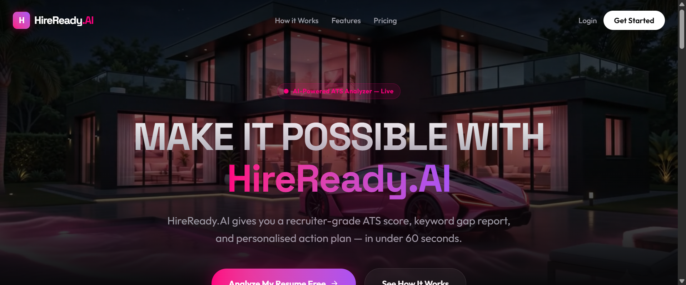
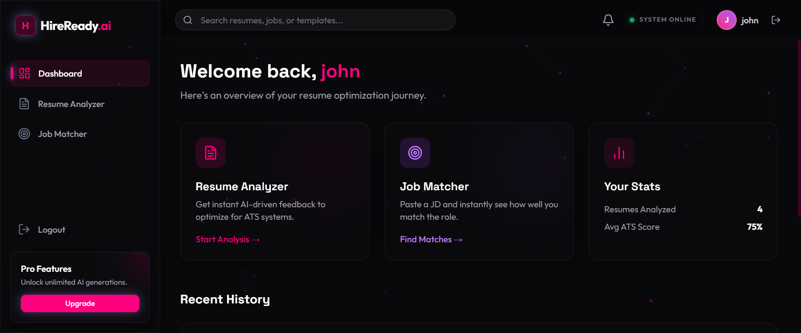
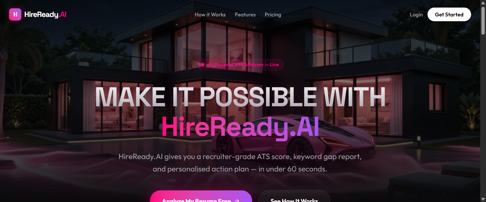
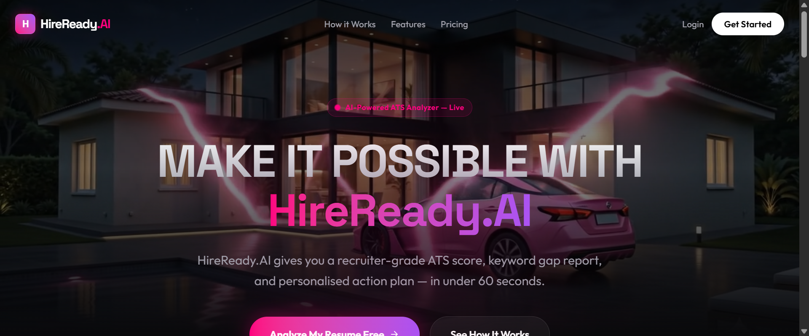

# HireReady.AI | AI-Powered Resume Analyzer & ATS Optimization SaaS

HireReady.AI is a high-performance, production-ready Software-as-a-Service (SaaS) application designed to empower candidates to optimize their resumes for Applicant Tracking Systems (ATS) and land interviews at top tech companies. By combining Google's Gemini AI with advanced vector similarity searches, HireReady.AI breaks down resume alignment, highlights skill gaps, and matches resumes against target job descriptions in real-time.

🔗 **Live Platform URL**: [https://hire-ready-ai-v2.vercel.app/](https://hire-ready-ai-v2.vercel.app/)

---

## 🚀 What it does
HireReady.AI acts as a simulated senior recruiter and ATS evaluator. Users upload their resumes in PDF, DOCX, or TXT format. The application extracts the text content (with bulletproof OCR fallbacks), matches it against technical keyword bases, and scores the resume. Users get:
*   An **ATS Compatibility Score (0-100)** calculated using weighted metrics (Keyword match, Skills relevance, Experience quality, Formatting, and Action verbs).
*   A **Recruiter Summary** detailing the resume's strengths and weaknesses.
*   An **Actionable Skill Gap Analysis** highlighting exact keywords and technologies missing from the resume.
*   An **AI Job Matcher** that compares their resume to any pasted job description, calculating compatibility and giving step-by-step optimization recommendations.

---

## 🛠️ Tech Stack

### Frontend Architecture
*   **Framework**: Next.js (App Router, Turbopack, React 19)
*   **Styling**: Tailwind CSS (custom HSL color utility layer)
*   **State Management**: Zustand (persisted state middleware)
*   **Animation**: Framer Motion (hardware-accelerated page transitions & micro-interactions)
*   **Icons**: Lucide React
*   **Charts**: Recharts (fully customized SVG visualizers)

### Backend Services
*   **Runtime**: Node.js & Express (TypeScript, TSX watch engine)
*   **File Parser**: Multer & PDF-Parse (with dual-engine semantic fallback)
*   **AI Engine**: Google Gemini API (`gemini-2.0-flash` for high-speed analysis, `text-embedding-004` for vector generation)

### Database & Auth
*   **Database/ORM**: Supabase (PostgreSQL, custom PL/pgSQL database triggers, and RPC functions)
*   **Authentication**: Supabase Auth (synchronous profile sync and session hooks)

---

## ✨ Features

*   **SaaS Dashboard**: A centralized hub showing resume score history, average scores, personal bests, and detailed matching analytics.
*   **Tier-Gated Scan Limits**: Free tier users get 3 full scans, protected by server-side middleware (`checkScanLimit.ts`). Payment pathways lead to Pro tier with unlimited generations.
*   **AI-Powered Job Matcher**: Direct vector embedding comparisons (Cosine Similarity) between resume and job description to show matching skills vs missing gaps.
*   **Netflix-Like Performance**:
    *   **IntersectionObserver**: Pauses the background landing page cinematic video player when scrolled out of viewport, freeing up GPU rendering cycles and rendering-pipeline resources.
    *   **Page Visibility Listener**: Stops requestAnimationFrame loops on particle canvases ([BackgroundNet.tsx](src/components/layout/BackgroundNet.tsx)) when tabs are hidden or inactive, resulting in 0% CPU consumption in background.
*   **Secure Multi-Format Parsers**: Advanced parsing of PDF, DOCX, and TXT files. Encrypted or flat-image PDFs automatically trigger a Gemini AI fallback parser to extract raw selectable text.

---

## 📸 Screenshots

### 1. Landing Page (Cinematic Video Background & Pink Energy Aesthetic)


### 2. Recruiter Analytics Dashboard


### 3. Detailed ATS Analysis & Keyword Gap Report


### 4. Interactive Job Matcher Page


---

## 💻 Local Setup Instructions

Follow these steps to run the frontend and backend servers locally:

### 1. Clone & Initialize the Workspace
```bash
git clone https://github.com/oindrilaverse/HireReady.ai-V2.git
cd HireReady.ai-V2
```

### 2. Configure Environment Variables

Create `.env.local` in the root directory (for Next.js frontend):
```env
NEXT_PUBLIC_API_URL=http://localhost:5000/api
NEXT_PUBLIC_SUPABASE_URL=https://your-supabase-project.supabase.co
NEXT_PUBLIC_SUPABASE_ANON_KEY=your-supabase-anon-key
```

Create `.env` inside the `backend/` directory (for Express API):
```env
PORT=5000
GEMINI_API_KEY=your-google-gemini-api-key
NEXT_PUBLIC_SUPABASE_URL=https://your-supabase-project.supabase.co
NEXT_PUBLIC_SUPABASE_ANON_KEY=your-supabase-anon-key
```

### 3. Install & Start Backend Services
```bash
cd backend
npm install
npm run dev
```
*The backend API server should now be running on [http://localhost:5000](http://localhost:5000).*

### 4. Install & Start Frontend Web Application
Open a new terminal at the project root:
```bash
npm install
npm run dev
```
*The Next.js Turbopack development server will spin up on [http://localhost:3000](http://localhost:3000).*

---

## 🔒 Security & Data Isolation
All user uploads are fully isolated via row-level security (RLS) policies on Supabase. Text parsing buffers are executed in-memory and never persisted locally. Database connections use SSL encryption.
