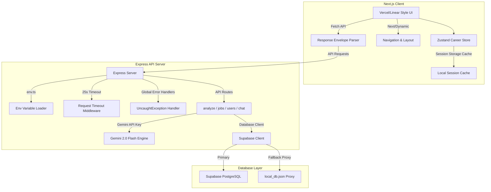

# HireReady.ai V2 — AI Resume Intelligence Platform

HireReady.ai V2 is a production-grade, high-performance AI Resume Intelligence Platform designed to look, feel, and operate like a YC-backed SaaS in 2026. Built with extreme stability, elegant styling, and advanced AI matching engines, it empowers job seekers to analyze their resumes and match against jobs with high accuracy.

---

## 🚀 Key Features

1. **Advanced AI Resume Analyzer**
   - Extracts complete resume content and runs deep analysis using the **Gemini 2.0 Flash API**.
   - Highlights total ATS Score breakdown, recruiter sentiment, quantified achievements, grammar critiques, action-verb suggestions, and detailed **STAR-method optimizations**.
   - Includes **client-side session caching** and deterministic file checksum check to prevent duplicate uploads of the same file.

2. **Job Matching & Semantic Engine**
   - Matches a resume against specific Job Descriptions (JDs) using Gemini-powered keyword density analysis and an ATS compatibility scoring matrix.
   - Suggests highly matching jobs from a repository, yielding: Job Title, Company, Match Percentage, Missing Skills, Required Skills, and Apply Links.
   - Built with a **robust mock fallback mechanism** to serve realistic jobs immediately on API/network quotas failure.

3. **Backend Stability & Resilience**
   - **Unified Environment Loader (`env.ts`)** prevents hoisting issues in ES modules by loading config before any routes or DB clients.
   - **Global Crash Prevention**: Top-level handlers for `uncaughtException` and `unhandledRejection` keep the node server alive.
   - **Serverless-Aligned Timeouts**: Capped at 25 seconds using custom middleware to match Vercel/AWS Serverless execution limits.
   - **Standardized API Envelope**: Every endpoint returns response wrapped in the `{ success: true/false, data: ..., error: { message, code } }` envelope.

4. **Premium UX & Design Language**
   - Stunning Vercel/Linear-inspired dark UI with glassmorphism, harmony HSL variables, and Framer Motion micro-interactions.
   - Custom-tailored **ShadCN-like loading skeletons** for metrics, dashboards, and job cards to completely eliminate blank states.
   - Optimization through Next.js Dynamic Imports (`next/dynamic`) for navigation components to ensure lighting-fast initial load times.

---

## 🛠️ Architecture Overview



---

## ⚙️ Environment Configuration

### Frontend (`.env.local`)
Create `.env.local` in the root directory:
```env
NEXT_PUBLIC_CLERK_PUBLISHABLE_KEY=your-clerk-publishable-key
CLERK_SECRET_KEY=your-clerk-secret-key
NEXT_PUBLIC_CLERK_SIGN_IN_URL=/login
NEXT_PUBLIC_CLERK_SIGN_UP_URL=/signup
NEXT_PUBLIC_CLERK_AFTER_SIGN_IN_URL=/dashboard
NEXT_PUBLIC_CLERK_AFTER_SIGN_UP_URL=/dashboard

NEXT_PUBLIC_API_URL=http://localhost:5000/api
NEXT_PUBLIC_SUPABASE_URL=your-supabase-project-url
NEXT_PUBLIC_SUPABASE_ANON_KEY=your-supabase-anon-key
```

### Backend (`backend/.env`)
Create `.env` in the `backend/` directory:
```env
PORT=5000
SUPABASE_URL=your-supabase-project-url
SUPABASE_KEY=your-supabase-service-role-key
GEMINI_API_KEY=your-gemini-api-key
```

---

## 📦 Installation & Setup

### Prerequisites
- Node.js >= 18.x
- npm or yarn

### Setup Backend
1. Navigate to the backend directory:
   ```bash
   cd backend
   ```
2. Install dependencies (copied to local folder):
   ```bash
   npm install
   ```
3. Run the development server:
   ```bash
   npm run dev
   ```
   The backend will compile TS files and start listening on port `5000`.

### Setup Frontend
1. Navigate back to the project root:
   ```bash
   cd ..
   ```
2. Install dependencies:
   ```bash
   npm install
   ```
3. Start the Next.js development server:
   ```bash
   npm run dev
   ```
   Open [http://localhost:3000](http://localhost:3000) to view the application.

---

## 🧪 Production Verification

### Backend Build Compilation
To check the compilation of the Express TypeScript project:
```bash
cd backend
npm run build
```

### Frontend Static Build
To check the compilation of the Next.js client project:
```bash
npm run build
```

---

## 🛡️ License
Distributed under the ISC License. © 2026 HireReady.ai.
